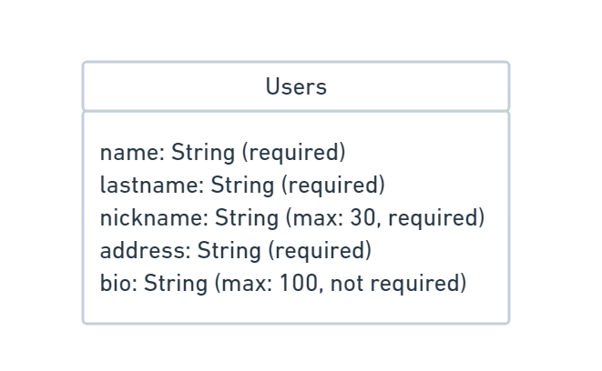
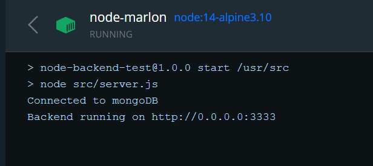

# Projeto Backend CRUD em JavaScript & Node.JS utilizando o Mongoose para manipular o MongoDB ⚙

[](https://developer.mozilla.org/pt-BR/docs/Web/JavaScript) [](https://nodejs.org/en/) [](https://docs.mongodb.com/) [](https://mongoosejs.com/docs/)

Simples CRUD de Users usando as técnologias JavaScript, Node.JS, MongoDB, Mongoose, Jest, Express.

Além disso na construção do projeto foi aplicado o `design pattern` padrão MVC, para os testes unitários TDD, além do conceito Single Responsiblity Principle(Princípio da responsabilidade única) do SOLID.

#### Requerimentos ✅

| Requerimento  | Uso |
| ------------- | -------------- |
| Docker 3.x    | Containerização |
| Node 12.x     | Executar os testes |
| Postman ^4.4.3 | Realizar requests à API |

#### Estrutura de pastas 🗂

```
├── src         # Onde se concentrão as pastas com toda a estrutura da aplicação
│   ├── controllers     # Controllers das requisições das rotas aos Services
│   ├── database        # Configuração de conexão com o Banco de Dados
│   ├── errors          # Configuração de mensagens de erros assíncronas retornadas
│   ├── middlewares     # Middlewares das rotas (Ex: errorHandling)
│   ├── models          # Models contém os Schemas da aplicação
│   ├── repositories    # Contém todas as operações realizadas diretamentes no BD
│   ├── routes          # Contém todas as rotas da aplicação
│   ├── services        # Contém todos os Services, com as regras de negócio da aplicação
│   ├── utils           # Utils com os funções usadas em mais de um lugar
│   └── validations     # Validations contém as validações das rotas com Celebrate
└── tests
    └── unit   # Contém todos os testes unitários da aplicação
```

## Estrutura do Banco 🗃



## Depois de clonar o repositório 📦

Execute o seguinte comando no terminal para instalar todas as dependências:

```bash
npm install
```
ou
```bash
yarn
```

## Criação dos containers com Docker para execução da aplicação 🐳

Execute o seguinte comando no terminal para criar uma build da aplicação em uma imagem do Node.JS onde a API executará e criar junto um container, dentro desse container serão criados 2 containers um para o Node.JS o outro para o MongoDB:

```bash
docker-compose -f docker-compose.yml up -d
```

> Após a execução o container node-backend-mvc será gerada no seu Docker

## Verificando se a aplicação está executando corretamente 🐳

Agora abra a sua  aplicação do docker e clique no container `node-backend-mvc` ➡ `node-marlon`, e deverá ver os seguintes logs:



> Se tudo estiver executando perfeitamente os logs da imagem acima deverão ser exibidos.

## Executando os testes ✅ ✅ ✅

Execute o seguinte comando no terminal para executar os testes unitários:

```bash
npm test
```
ou
```bash
yarn test
```

# Documentação com os endpoints da API no Postman 🐱‍🚀

Clique no botão abaixo e acesse a documentação com todos os endpoints da API, é possível testá-las pelo próprio Postman:

[](https://tinyurl.com/node-backend-mvc)

# Users 👨‍💻

**POST** Create User:

Cria um usuário, já há um User **John Doe** como exemplo definido no Body da requisição.

> /users

**GET** Show User By Nickname:

Mostra os dados `name, lastname & nickname`, é necessário passar o `nickname` do usuário como Path variables no request.

> /users/:nickname

> Exemplo: /users/thejohndoe

**GET** List By Name And Lastname:

Lista todos os usuários filtrando pelo `name e/ou lastname`, passando os valores como Query params na requisição:

> /users/?name=john&lastname=doe
> /users/?name=john
> /users/?lastname=doe

As 3 maneiras funcionam, também se colocar apenas uma letra do nome ele retornará uma lista com os `names e/ou lastnames`

**PUT** Update Nickname:

Nesta rota é possível fazer a troca do `nickname` do usuário, enviando o nickname no corpo da requisição, passando o ID do usuário como Path variables do request:

> /users/nickname/:id

**PUT** Update User Info Lastname and Address:

Nesta rota é possível alterar `lastname & address` do usuário, enviando o as informações no corpo da requisição, passando o ID do usuário como Path variables do request:

> /users/info/:id

**DELETE** Delete User:

Nesta rota é possível deletar um usuário, pelo ID informado no Path Variable.

> /users/:id
